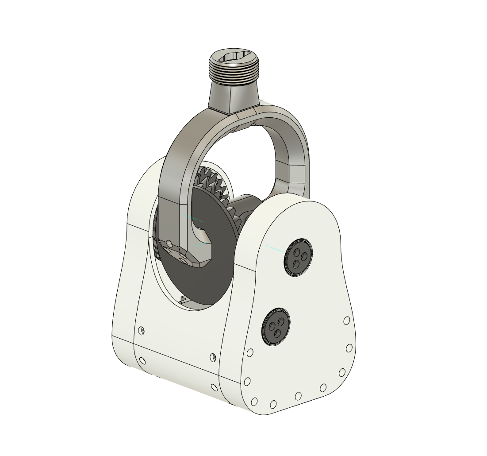

# FFB-base-differential

[https://github.com/p0lysim/FFB-base-differential/blob/main/IMG/Thumbnail.PNG]()

## **Components used**

* [BLDC 5065 140kv BLDC motors : https://amzn.to/3Hg6zxa](https://amzn.to/3Hg6zxa)
* [MKS XDrive board : https://amzn.to/456QqmO](https://amzn.to/456QqmO)
* [Bearing 20x27x4 (12 pcs) : https://amzn.to/46OaAmP](https://amzn.to/46OaAmP)
* [Bearing 25x37x7 (2pcs) : https://amzn.to/3H3fCBD *](https://amzn.to/3H3fCBD)
* [M3 wood screw pack : https://amzn.to/45HISak](https://amzn.to/45HISak)
* [Some PLA fillament : https://amzn.to/4loAYaD](https://amzn.to/4loAYaD)
